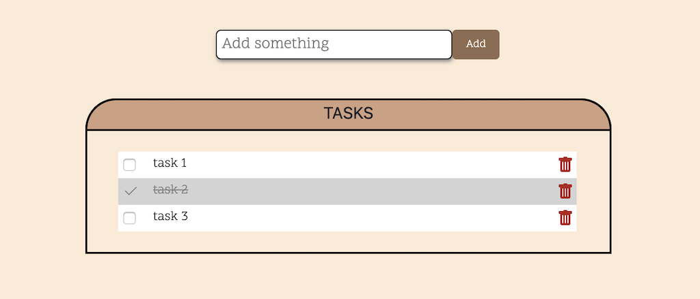

# Project Name: To-do list

## Description
Duration: 2 Days Sprint

 I have done this project in 16 hours.
 Below are problems that I did solve:
    * : problem
    - : how did I solve it

  ### Base 
  * Create a front end experience that allows a user to create a Task.
    - I create an input field and a button in HTML file.

  * The Task should be stored inside of a database (SQL)
    - I use Postico Postgres to store my database. In Postico, I create a file name weekend-to-do-app that contains all the tasks that I will add later.

  * The front end should refresh to show all tasks that need to be completed.
    - I set up the stuff inside the server-side and router. To add tasks and append the to DOM:  
        - On the client-side, I use Jquery to add and get tasks then append data from the database to DOM.
        - To save data in the database. Via AJAX, I create GET and POST requests in the server/router.

  * Task's visual representation should change on the front end. The complete option should be  'checked off'. 
    - Then I create the complete buttons for each task. I use some CSS style to when the button is clicked => visual representation change
    - 
  * Deleting a Task should remove it both from the front end as well as the Database.
    - I create a delete button. Using DELETE request in route
        
  * Styling: Background, font family and size, text-color of Tasks (to show completed or not), background-color Tasks (to show completed or not)
    - I write codes in style.css file to do this problem.

## Screen Shot

## Built With
HTML, CSS, JavaScript, Jquery,Node , database.

## Acknowledgement
Thanks to Prime Digital Academy who equipped and helped me to make this application a reality. 

## Support
If you have suggestions or issues, please email me at thyvu411@gmail.com

